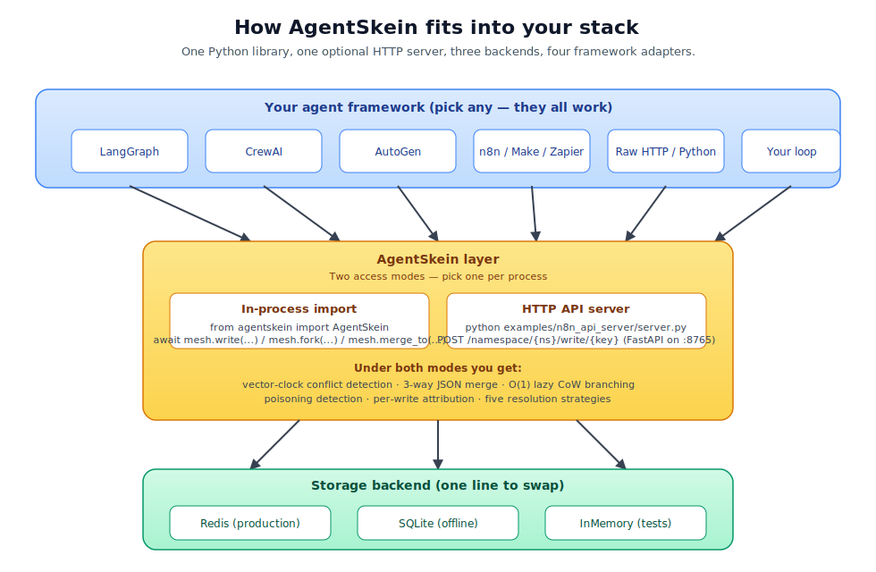
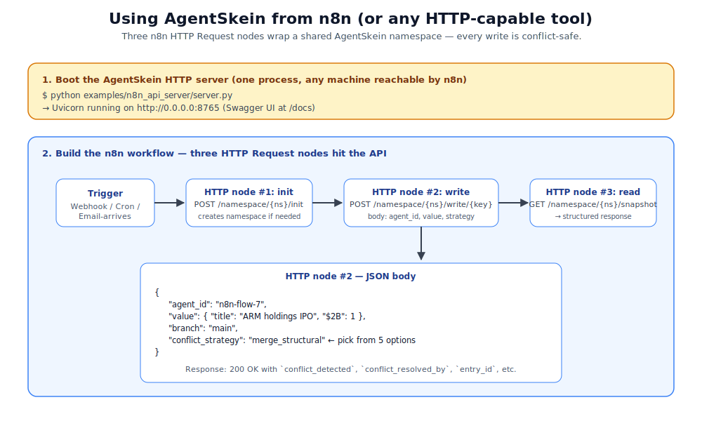
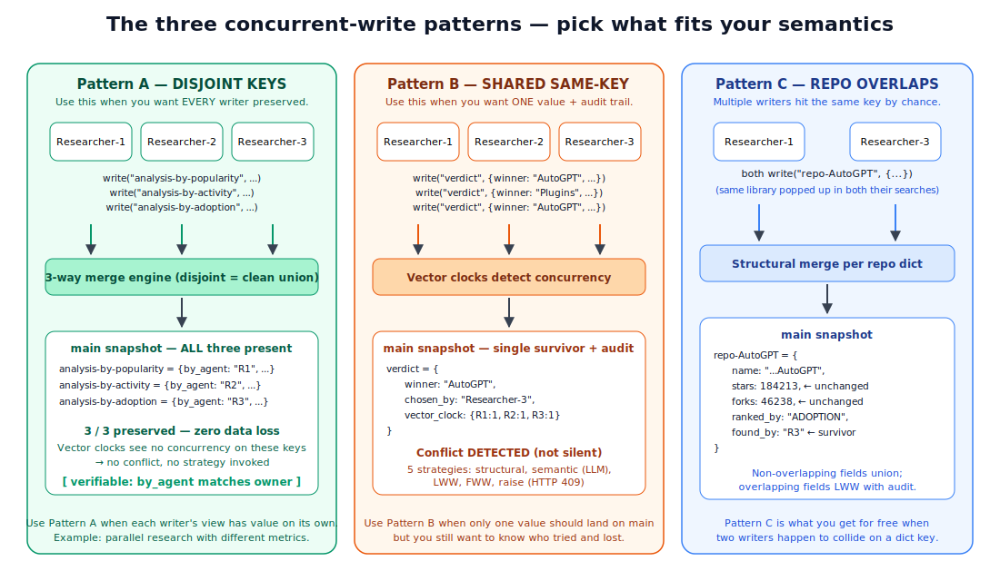
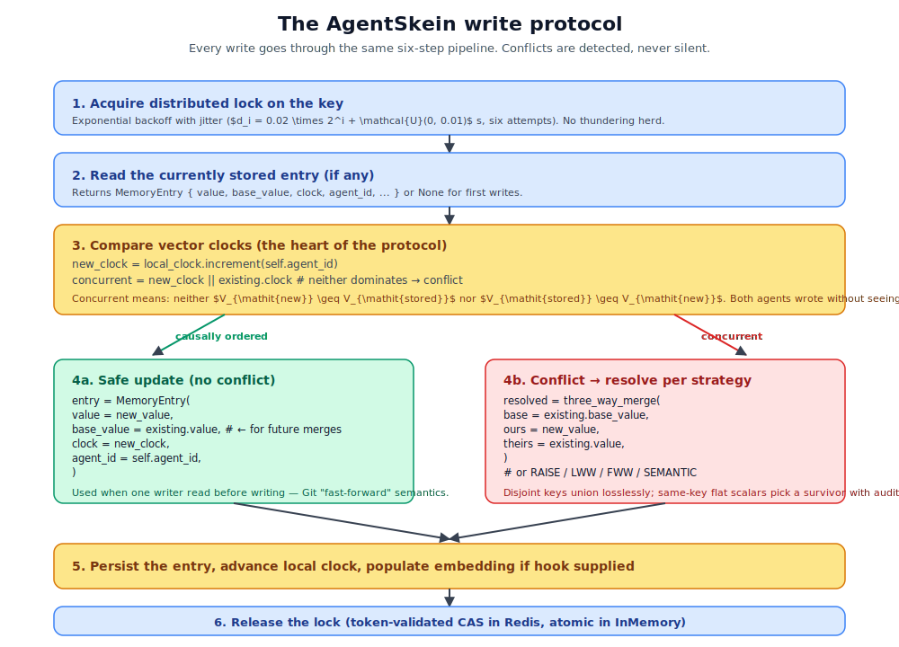
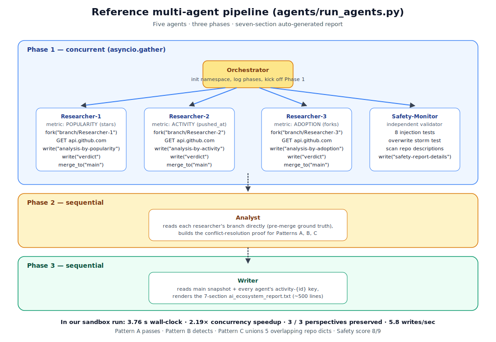

# AgentSkein — Documentation Index

Diagrams and integration recipes for people plugging AgentSkein into their own
agent stacks. Every diagram is plain SVG that renders inline on GitHub and
scales on any screen.

## Diagrams

### 1. [`integration-architecture.svg`](integration-architecture.svg)

Where AgentSkein sits in your stack: your agent framework on top
(LangGraph / CrewAI / AutoGen / n8n / raw HTTP), the AgentSkein layer in the
middle (in-process import OR HTTP server), the pluggable storage backend at
the bottom (Redis / SQLite / InMemory). Start here.



### 2. [`n8n-workflow.svg`](n8n-workflow.svg)

A concrete walkthrough of using AgentSkein from n8n with three HTTP Request
nodes (`init` → `write` → `read`). Includes the exact JSON body you POST to
`/namespace/{ns}/write/{key}` and what comes back.



### 3. [`three-patterns.svg`](three-patterns.svg)

The single most important picture in the docs: side-by-side comparison of
Pattern A (disjoint keys, every writer preserved), Pattern B (shared key,
detect + audit, single survivor) and Pattern C (repo-overlap auto-union).
Pick the pattern that matches your semantics before you write the first
line of agent code.



### 4. [`conflict-flow.svg`](conflict-flow.svg)

The six-step write protocol — lock with exponential backoff, read existing,
compare vector clocks, take the safe-update branch OR the conflict-resolve
branch, persist, release. Useful when explaining the design to a sceptic.



### 5. [`multi-agent-pipeline.svg`](multi-agent-pipeline.svg)

The reference pipeline in `agents/run_agents.py`: Orchestrator → three
Researchers + Safety-Monitor (concurrent in Phase 1) → Analyst (Phase 2) →
Writer (Phase 3). Shows exactly which keys each agent writes and which
patterns are exercised on each.



## Integration recipes by stack

Every recipe assumes the HTTP server is running: `python examples/n8n_api_server/server.py`.

### n8n / Make / Zapier

1. Drop an **HTTP Request** node after your trigger.
2. Method: `POST`, URL: `http://<host>:8765/namespace/<ns>/write/<key>`.
3. Body (JSON):
   ```json
   {
     "agent_id":            "n8n-flow-7",
     "value":               { "...": "your structured value" },
     "branch":              "main",
     "conflict_strategy":   "merge_structural"
   }
   ```
4. To read everything back: `GET /namespace/<ns>/snapshot?agent_id=n8n-flow-7&branch=main`.
5. To run multiple flows concurrently without losing data: give each flow a
   unique `agent_id` and write to a unique top-level key (Pattern A).

See [`n8n-workflow.svg`](n8n-workflow.svg) for the full diagram and
[`../AGENTS_INTEGRATION_GUIDE.md`](../AGENTS_INTEGRATION_GUIDE.md) for the n8n
workflow JSON template.

### LangGraph

Replace your checkpointer in one line:

```python
from agentskein.adapters.langgraph_adapter import AgentSkeinCheckpointer

checkpointer = AgentSkeinCheckpointer(
    agent_id="orchestrator",
    namespace="my-workflow",
    redis_url="redis://localhost:6379/0",
)
graph = StateGraph(MyState).compile(checkpointer=checkpointer)
```

Every `graph.ainvoke(...)` is now checkpointed with full conflict detection,
attribution, and branchable history. Multiple graph runs against the same
namespace will detect concurrent writes instead of silently overwriting.

### CrewAI

```python
from agentskein.adapters.crewai_adapter import AgentSkeinStorage

storage = AgentSkeinStorage(namespace="my-crew")
await storage.save("researcher", "finding-1", {"data": "..."})
results = await storage.search("writer", "finding", limit=5)
```

Each crew member supplies its own `agent_id`. CrewAI writes route through
the same conflict-detection pipeline.

### AutoGen

```python
from agentskein.adapters.autogen_adapter import AgentSkeinStore

store = AgentSkeinStore(namespace="my-team")
await store.remember(agent_name="planner",  key="plan-step-3", value={"step": 1})
plan = await store.recall(agent_name="executor", key="plan-step-3")
```

### Raw Python

```python
from agentskein import AgentSkein
from agentskein.storage.memory_backend import InMemoryBackend

backend = InMemoryBackend()
agent = AgentSkein("agent-1", "my-namespace", backend=backend)
await agent.init()

branch = await agent.fork("scratchpad")
await branch.write("finding", {"source": "...", "value": ...})
await branch.merge_to("main")
```

## Pattern picker — which one do I use?

| Symptom in your workflow                                            | Pattern  |
|---------------------------------------------------------------------|----------|
| "I want every agent's contribution stored, full audit"              | **A** — give each agent a unique top-level key |
| "I want one final answer, but I want to know who proposed what"     | **B** — same key, `merge_structural` |
| "I want one final answer, freeform text, blend the candidates"      | **B** — same key, `merge_semantic` + LLM callable |
| "I want first writer locked in, second is an error"                 | **B** — same key, `first_write_wins` or `raise` |
| "Two agents independently fetched the same record — just keep one"  | **C** — happens automatically, no action needed |

If in doubt, default to **Pattern A**. It's the only pattern that
mechanically preserves every writer.

## Verifying your integration works

1. Start the HTTP server.
2. Drive two writes to the same key from two HTTP clients with different
   `agent_id`s and `conflict_strategy: "raise"`.
3. The second write should return HTTP 409 with the conflict body, not
   silently win.
4. Switch to `conflict_strategy: "merge_structural"` and verify the merged
   value carries `chosen_by` attribution.
5. To stress-test, run the reference pipeline: `python agents/run_agents.py`.
   Open `agents/ai_ecosystem_report.txt` and look for the Section 1 line
   `3 of 3 researcher perspectives preserved on main`. If you see that,
   your install is healthy.

## See also

- [`../README.md`](../README.md) — project landing page
- [`../AGENTS_INTEGRATION_GUIDE.md`](../AGENTS_INTEGRATION_GUIDE.md) — full
  step-by-step integration manual
- [`../CONTEXT.md`](../CONTEXT.md) — architectural deep dive
- [`../agents/README.md`](../agents/README.md) — reference pipeline walkthrough
- [`../agentskein_paper.tex`](../agentskein_paper.tex) — 7-page technical report
